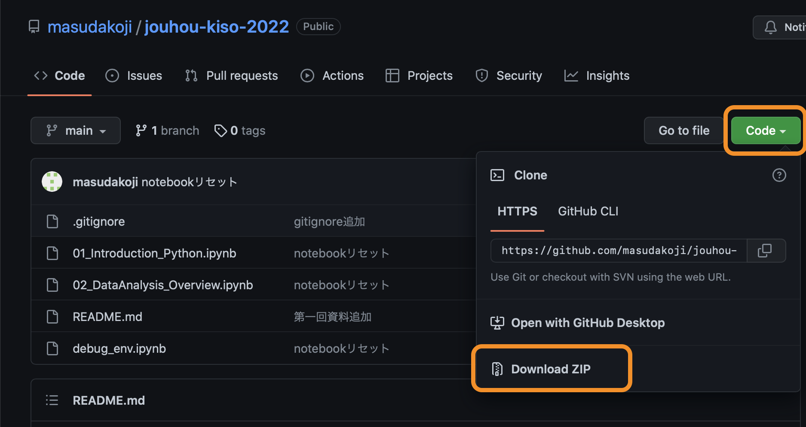
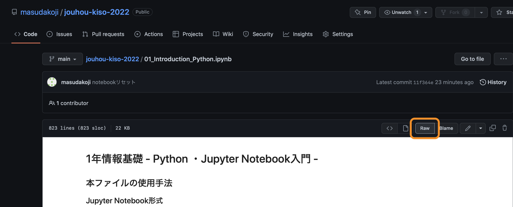
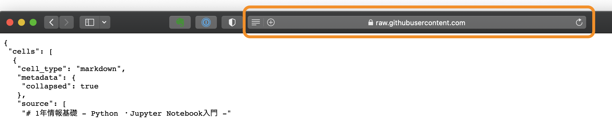
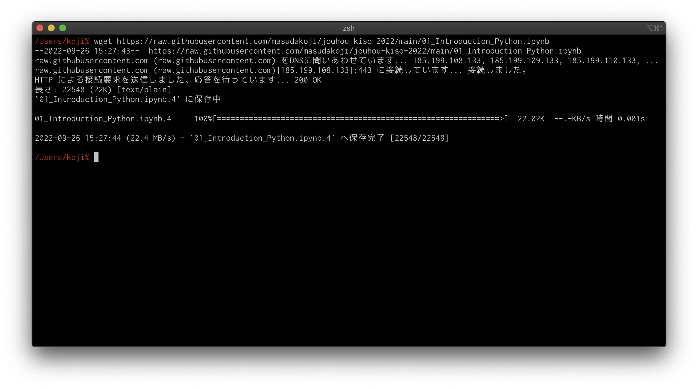

# jouhou-kiso-2022
Course materials for Fundamentals of Information Technology

## 授業資料

- [Python ・Jupyter Notebook入門](01_Introduction_Python.ipynb)
  - Pythonの簡単な紹介・四則演算の計算方法
  - インデントなどの取り扱いについても言及しています
- [Pythonを使ったデータ解析の概要](02_DataAnalysis_Overview.ipynb)
  - DataFrameや、irisデータセットを用いたデータ解析の例
  - 演習や課題としてさせるよりは、教員のデモとして用いるのが良いかと思います
  - 興味がある学生がいれば提供してもよろしいかと思います
- [コメント・print文・様々な演算](03_Calculation_Exercise.ipynb)
  - コメント文の書き方
  - print文の書き方
  - 初等関数（log,expなど）の紹介
    - これらは1年後期に習うので、一応紹介するだけでよろしいかと思います
  - 変数を使った演算
    - 8問あります
    - 四則演算や、剰余などを使った問題演習
    - 最後に答え合わせする関数もつけています
- [リスト・繰り返し処理](04_List_Array.ipynb)
  - リスト
  - 繰り返し処理

## スライド
- [Google Colaboratoryの導入](slide/01_introduce_colab.pdf)

## 関連ファイル

- [実行環境のバージョン確認](debug_env.ipynb)

## 使い方
ファイル一式をDLする場合、「Code」ボタンをクリックして展開されるメニューから「Download ZIP」を選択してください。

ファイル単体をDLする場合、ファイル単体を開いて「RAW」ボタンを押すとファイル単体のアドレスが取得できます。

ファイル単体のアドレスがわかれば、wgetなどでDLできます。

