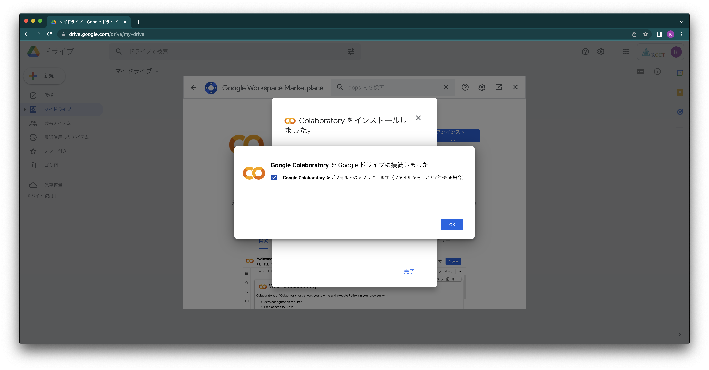

<!-- タイトルスライドのフォントサイズ修正 -->
<!-- _class: lead 　 -->

# 1年 情報基礎
## Google Colaboratoryの導入

---
<!-- _class: lead 　 -->
# Google Colaboratoryのアプリをインストール

---
Google Driveの「マイドライブ」を開く

---
「新規」ボタンを押して「その他」→「アプリを追加」を選択

---
検索メニューから「Colaboratory」を検索(“col”ぐらいまで打てば候補で出てきます）

---
「Colaboratory」のアプリがヒットしました

---
「インストール」ボタンを押してインストール

---
「続行」をクリックして、インストールを開始

---
アカウントの選択が必要なこともあります。

---
インストールが完了

---
インストールが完了したら、アプリのインストール画面は閉じておきます

---
Google Colaboratoryのアプリが追加されました

---
<!-- _class: lead 　 -->
# Classroomで配布された授業資料を使う

---
Classroomで配布された“Jupyter Notebook形式（ファイル名の末尾がipynb）”を開くとこの様に表示される  
「Google Colaboratoryで開く」をクリック

---
Jupyter Notebook形式のファイルが開いた

---
途中でこの様なメッセージが出ることもあります。「このまま実行」します。

---
途中でこの様なメッセージが出ることもあります。その場合は指示に従います。

---
「ドライブにコピー」ボタンを押して

---
「ドライブにコピー」されていないファイルを保存しようとすると・・・

---
権限がないので保存できない

---
コピーしたファイルの場所を探す。「ファイル」→「ドライブで探す」と進むと・・・

---
“Colab Notebooks”フォルダが作成されているので・・・

---
「ドライブにコピー」されたファイルは“Colab Notebooks”の中に収納される

