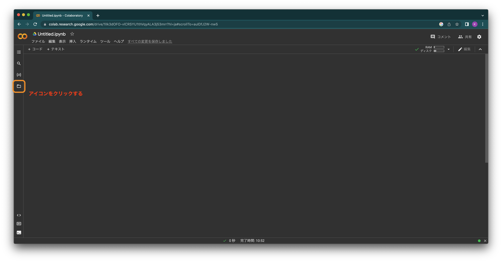
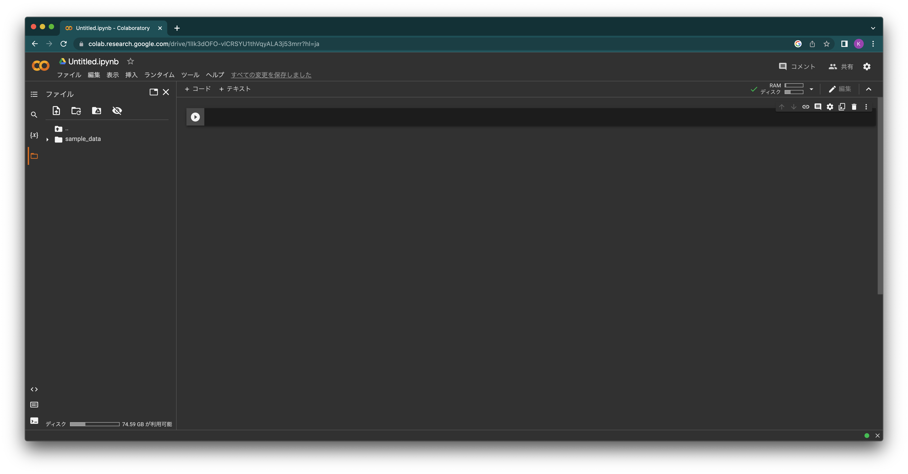
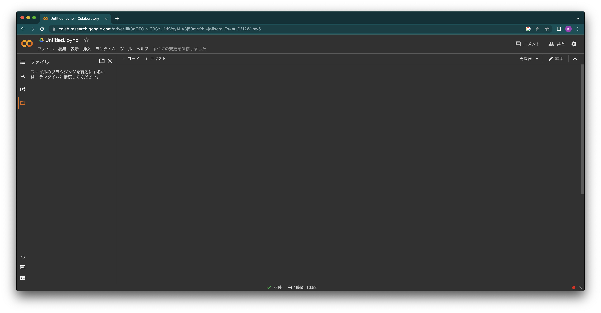
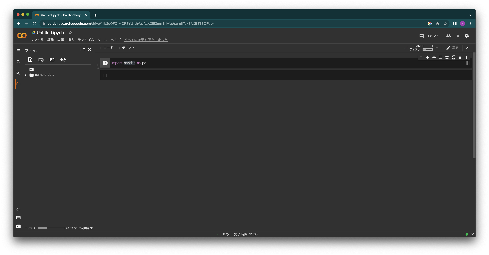
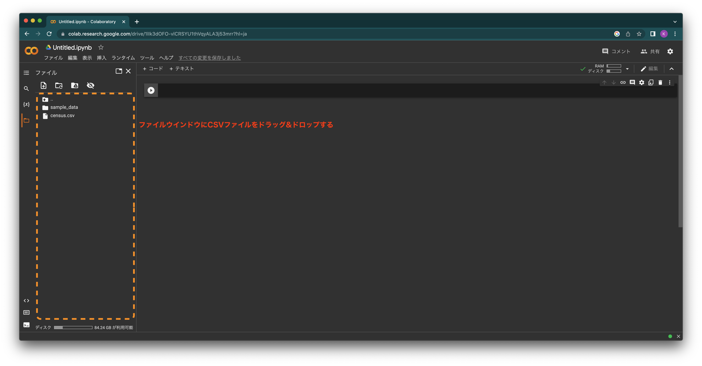
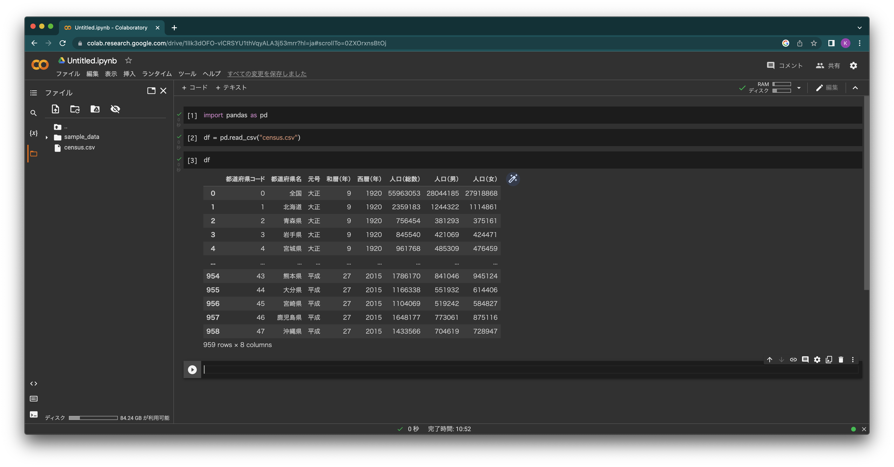

<!-- タイトルスライドのフォントサイズ修正 -->
<!-- _class: lead 　 -->

# 1年 情報基礎
## CSVファイルのアップロード

---
Google Colaboratoryを開いて、左のメニューあるアイコンをクリック

---
「ファイル」メニューが開く

---
もし、次のような表示が出た場合、ランタイムに接続されていないので、コードを何か追加して実行

---
コードを追加して実行するとランタイムに接続できるので、次のように表示される

---
自身のPC上にあるCSVファイルをドラッグ&ドロップすると、CSVファイルを追加できる

---
アップロードしたCSVファイルを読み込むことができた

